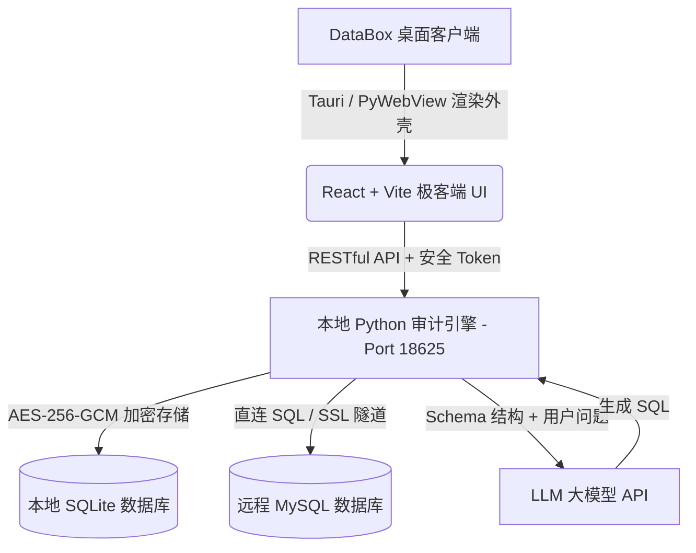

# 📦 DataBox — 智能安全数据探索客户端 (Secure AI-Powered Database Client)

[](https://www.python.org/)
[](https://nodejs.org/)
[](https://opensource.org/licenses/MIT)
[]()
[]()

> **DataBox** 是一款面向运营、业务、数据分析人员的 **本地智能安全数据库客户端**。它集成了传统数据库管理工具（如 Navicat）的直连便捷性，同时融入了先进的 **本地 AI 自然语言问数 (Text-to-SQL)** 能力和 **全方位的安全审计围栏 (SQL Guardrails)**。

[English](#english-documentation) | [中文说明](#chinese-documentation)

---

<a name="chinese-documentation"></a>

## 🌟 核心设计理念与安全原则

传统云端 AI 问数服务常常要求用户上传数据库连接密码或导入敏感业务数据，这带来了极大的安全合规隐患。DataBox 从第一天起就遵循 **“数据不出本季、密码绝不上云”** 的核心原则：

*   **零密码云端暴露 (No Password Leak)**: 所有数据库连接信息均在用户本机通过 `AES-256-GCM` 高强度加密，本地安全存储（SQLite），绝不上传任何云端服务器。
*   **本地安全围栏 (Strict SQL Guardrail)**: 内置基于 `sqlglot` 抽象语法树（AST）分析的纯本地 SQL 安全审计系统，在任何 SQL 发送到目标数据库前进行强制检测，拦截高危写操作、无条件更新/删除、隐式全表扫描等行为。
*   **AI 问数隐私保护 (Privacy-First AI)**: 大语言模型（LLM）仅接收数据库 Schema 结构信息与用户的自然语言问题，**真实的查询结果和数据库密码绝不发送给大模型**。
*   **双阶段安全确认 (Two-Phase Confirmation)**: DDL 修改、智能测试数据生成、备份还原及数据源删除等高危操作均具备严格的双阶段确认保护。同时支持通过环境变量 `DATABOX_BYPASS_CONFIRMATION=1` 实现 CI/CD 自动化流水线的静默绕过。

---

## 🏗️ 系统整体架构

DataBox 采用 **“轻量桌面外壳 + 极速前端 UI + 本地 Python 引擎”** 的三层架构，保证了跨平台的高性能渲染与 AI 数据分析生态的无缝整合。



1.  **React 前端极客端 (desktop/src)**: 提供直观的数据源配置、Schema 浏览器、智能 AI 问数控制台、交互式 ECharts 图表展示、SQL 编辑器（Monaco Editor）和审计历史面板。
2.  **本地 Python 引擎 (engine/)**: 启动本地 FastAPI 服务器，作为安全边界和数据执行器。负责 Schema 本地缓存、安全围栏过滤、敏感数据脱敏、数据源 SSL 加密直连以及大模型接口对接。
3.  **Tauri 桌面外壳 (desktop/src-tauri)**: 提供原生的桌面级分发和进程拉起能力；同时支持通过 `pywebview` 渲染硬件加速的原生窗口。

---

## 📂 项目目录结构梳理

```text
DataBox/
├── desktop/                    # 前端及 Tauri 桌面壳代码
│   ├── src/                    # React 开发源码
│   │   ├── components/         # 核心可重用组件 (SQL编辑器、ER图、AI面板、数据表等)
│   │   ├── pages/              # 系统主页面 (工作台、数据源、备份管理、Dashboard等)
│   │   ├── hooks/              # 封装的数据请求与查询执行 hooks
│   │   └── lib/                # 前端公共类库与查询动作解析器
│   └── src-tauri/              # Rust Tauri 桌面分发配置及安全策略
├── engine/                     # Python 本地安全及 AI 问数引擎
│   ├── api/                    # FastAPI 路由端点 (数据源、表结构设计、备份、AI问数等)
│   ├── policy/                 # 安全策略定义 (双阶段确认引擎、敏感字段脱敏、脱敏管理器)
│   ├── schemas/                # Pydantic 接口契约与数据模型定义
│   ├── migrations/             # Alembic 轻量级数据库版本迁移历史
│   ├── tests/                  # 包含 190+ 测试用例的完整自动化测试套件
│   ├── ai.py                   # 大语言模型接口对接与 Schema 精准检索
│   ├── crypto.py               # AES-256-GCM 编解码与秘钥本地管理
│   ├── db.py                   # 本地 SQLite 元数据库初始化及 Session 管理
│   ├── executor.py             # 具备超时控制与行数限制的 SQL 执行器
│   ├── guardrail.py            # 基于 AST 语法分析的本地 SQL 安全围栏
│   └── schema_sync.py          # 远程 Schema 异步同步与 ER 图模型构建
├── docs/                       # 系统核心设计、PRD、路线图及开发指南
│   ├── v1_development_guide.md # V1 核心开发指导文档（原“第一版.md”）
│   ├── ROADMAP.md              # 产品未来路线规划
│   ├── PRD.md                  # 产品需求文档说明
│   └── walkthrough_22nd_round.md # 第22轮迭代：生产稳定性确认绕过设计归档
├── databox-mysql-ssl-test/     # 本地 Docker-Compose MySQL 带 SSL 证书一键联调环境
├── start.py                    # 【快速启动】本地一键启动助手 (拉起前后端服务并在浏览器中打开)
├── run_desktop.py              # 【快速启动】本地 Native 独立窗口渲染启动器 (pywebview 驱动)
├── pyproject.toml              # Python 项目 mypy 类型检查及环境配置
└── requirements.txt            # Python 后端运行核心依赖列表
```

---

## 🔌 SQL Action Engine (DSL 注解式快捷操作引擎)

DataBox 创新性地引入了 **SQL 注解式快捷操作与编排引擎 (SQL Action Engine)**。它并非普通的“在 SQL 输入框旁堆叠按钮”，而是独立开发了一套**前端轻量级 DSL（以 `@` 为指令注解） + 编译执行计划 + 插件化 Processor 生命周期 + 后端安全执行网关** 的高性能编排架构。

### 🔄 多阶段生命周期管线 (Pipeline Lifecycle)

当用户输入带有 `@` 注解指令的 SQL 时，系统会在前端启动多生命周期管线：

```text
用户输入 SQL + @指令
        │
        ▼
   [parseAll] ────── 扫描全部 @ 注解指令，提取参数
        │
        ▼
   [buildPlan] ───── 封装并构建 QueryExecutionPlan
        │
        ▼
   [validate] ────── 校验语法规则，判定指令互斥与参数冲突
        │
        ▼
   [compile] ─────── 编译阶段改写 SQL (如 LIMIT 追加, EXPLAIN 改写)
        │
        ▼
 [beforeExecute] ─── 执行前注入全局上下文参数 (如 Timeout 设置)
        │
        ▼
 [aroundExecute] ─── 执行中事件流拦截
        │
        ▼
   [executeSQL] ──── 调后端安全执行网关 (PolicyEngine & Guardrail)
        │
        ▼
 [afterExecute] ──── 成功执行后结果后处理 (如可视化图表渲染、文件本地导出)
```

### 🛠️ 插件化 Processor 架构

Action Engine 采用统一的插件化 Processor 注册表架构。所有的注解动作都被高度内聚地抽象为微插件：
*   **`@limit [rows]`** (编译期)：自动为 SQL 编译出最安全可靠的 `LIMIT` 分页，防止拉取海量数据拖垮网络。
*   **`@timeout [seconds]`** (准备期)：为客户端注入查询最大超时阈值，秒级超时保护，防止长查询挂死数据库物理连接。
*   **`@explain`** (编译期)：自动改写为执行计划评估模式，方便开发排查慢查询与索引命中的性能瓶颈。
*   **`@export [csv/json/xlsx]`** (后处理期)：查询成功后前端自动本地序列化，即时触发浏览器下载保存，实现指令级自动数据归档。
*   **`@chart [bar/line/pie] x=列名 y=列名`** (表现期)：成功查询后自动将数据转换为 ECharts 图表，同数据表格并列渲染，可视化体验极佳。

### 💎 UI 体验与表现层增强

*   **智能指令补全 (Directive Intellisense)**：当用户在命令行交互终端输入 `@` 时，系统会弹出微晶浮光感的指令提示框，提供指令参数格式、作用说明以及丰富的代码用例。
*   **可解释执行计划预览卡 (Plan Preview Card)**：指令键入后，控制台下方实时绘制精美的执行计划详情面板，展现 **“原始 SQL” 与 “实际执行编译 SQL” 的 Diff 对比**、参数变量注入效果以及计划验证的警告/报错诊断信息。

---

## ⚡ 快速启动指南

### 1. 环境依赖准备
确保您的计算机上已安装以下环境：
*   **Python**: 3.12 或更高版本 (推荐使用 Conda 或 venv 管理虚拟环境)
*   **Node.js**: 18.x 或更高版本 (前端构建及包管理工具)

### 2. 一键启动 (Web 开发版)
在项目根目录下执行以下命令，启动助手会自动为您校验并安装 Python 和 Node 依赖，并自动拉起 Local Engine 后端和 Vite 前端，最后在您的系统默认浏览器中打开页面：
```bash
python start.py
```
*   **安全后端监听**: `http://127.0.0.1:18625`
*   **前端交互页面**: `http://localhost:5173`
*   *提示：进入页面后，可直接点击“一键秒连演示库”秒级加载包含 20 张表的示例库进行 AI 问数安全测试。*

### 3. 一键启动 (原生桌面窗口版)
如果您希望像使用 Navicat 桌面软件一样，在一个独立且具备硬件加速的 Native App 窗口中操作 DataBox，可执行：
```bash
python run_desktop.py
```
这会调用系统的 `pywebview` 引擎，拉起精美的无边框独立窗口，加载完整的桌面极客体验。

---

## 🧪 自动化测试验证

DataBox 拥有极高测试覆盖率的高标准自动化测试集（共 **194 个核心测试**），覆盖密码加密、AST安全过滤、敏感数据模糊脱敏、SSL双向握手、备份还原以及多阶段确认策略。

在根目录下运行以下命令，即可执行完整的测试套件：
```bash
python -m pytest engine/tests
```

---

<br/>
<hr/>

<a name="english-documentation"></a>

## 🌟 Core Philosophy & Security Principles

Traditional cloud AI database tools often require uploading sensitive database passwords or full datasets to the cloud, introducing massive security and compliance risks. DataBox is built ground-up on the philosophy of **"No DB Passwords to Cloud, All Actions Executed Locally"**:

*   **Zero Password Exposure**: All remote credentials are encrypted locally using `AES-256-GCM` and stored securely inside a local SQLite file.
*   **Strict SQL Guardrails**: A robust, zero-LLM local AST analysis layer built on `sqlglot` scans every SQL statement before execution, blocking dangerous actions, un-indexed updates, or bulk deletions.
*   **Privacy-First AI**: The LLM only receives schema definitions (DDL) and the user's natural language queries. **Actual table data and raw credentials never leave your machine**.
*   **Two-Phase Confirmation**: Destructive DDL changes, backup restores, and database deletions require explicit confirmation. An automated bypass mechanism is supported using the environment variable `DATABOX_BYPASS_CONFIRMATION=1` for CI/CD integrations.

---

## 🏗️ Architecture Overview

DataBox features a high-performance three-tier design:
*   **React Desktop Client (desktop/src)**: A gorgeous, dark-themed developer workbench featuring Monaco SQL Editor, custom interactive tables (TanStack Table), responsive charts, and an AI chat console.
*   **FastAPI Local Engine (engine/)**: Runs in a Python subprocess locally. It acts as the secure API gateway, handling schema sync, AES cryptography, and query execution.
*   **Native Window System (Tauri / PyWebView)**: Wraps the developer environment into a lightweight desktop distribution.

---

## 📂 Directory Layout

*   `desktop/` - React SPA frontend and Rust Tauri desktop wrapper.
*   `engine/` - FastAPI backend, SQLite schema models, safety filters, and test suites.
*   `docs/` - Comprehensive architecture specifications, product requirement documents, and dev history.
*   `databox-mysql-ssl-test/` - A sandbox database with SSL verification utilities.
*   `start.py` - Standard bootstrap script to check environments, install dependencies, and run services.
*   `run_desktop.py` - Hardware-accelerated native webview frame loader.

---

## 🔌 SQL Action Engine (DSL Annotation Shortcut Engine)

DataBox introduces an innovative **SQL Annotation Shortcut & Orchestration Engine (SQL Action Engine)**. Rather than simply packing action buttons near the input field, we developed a highly modular system consisting of a **lightweight frontend DSL (using `@` comment directives) + Execution Plan compiler + Plugin-based Processor lifecycle + Backend safety gateway**.

### 🔄 Multi-Phase Lifecycle Pipeline

When a user writes a SQL query with `@` annotations, the Action Engine triggers a multi-phase lifecycle:
1.  **`parseAll`**: Scans the text for `@` directive comments, extracting arguments and separating the raw executable query (`pureSql`).
2.  **`validate`**: Runs semantic checks and flags parameter conflicts or mutual exclusivity (e.g. `@explain` and `@export` cannot run together).
3.  **`compile`**: Rewrites query compile targets (e.g. `@limit` dynamically appends pagination, `@explain` prepends the clause).
4.  **`beforeExecute`**: Injects runtime arguments (e.g. `@timeout` configuring clientside socket limitations).
5.  **`aroundExecute`**: Intercepts active execution buffers.
6.  **`afterExecute`**: Triggers post-execution processors (e.g. `@chart` rendering the visual dashboard, `@export` executing file compilations).

### 🛠️ Plugin-Based Processor Architecture

The Action Engine implements a extensible Registry pattern. Each annotation behavior is isolated as a micro-plugin Processor:
*   **`@limit [rows]`** (Compile Phase): Dynamically injects clean `LIMIT` pagination to prevent large select statements from saturating client memory.
*   **`@timeout [seconds]`** (Prepare Phase): Configure execution socket limits in seconds, shielding resources against infinite slow-query hanging.
*   **`@explain`** (Compile Phase): Converts query to plan-analysis mode, helping verify indexes and performance bottlenecks.
*   **`@export [csv/json/xlsx]`** (Post-execution Phase): Serializes query result sets and initiates automatic file downloads locally in the browser.
*   **`@chart [bar/line/pie] x=col y=col`** (Presentation Phase): Renders ECharts visualizations inline right alongside standard data tables.

### 💎 Console & Intellisense Experience

*   **Directive Autocomplete**: Typing `@` in the interactive console displays a beautiful glassmorphic floating menu illustrating usage patterns, argument schemas, and descriptions.
*   **Explainable Plan Preview**: Consoles display a live plan summary compiling **"Original SQL" vs "Compiled Execution SQL" Diff analysis** alongside warning diagnostics.

---

## ⚡ Quick Start

### 1. Prerequisites
Ensure you have the following installed:
- **Python**: `3.12+`
- **Node.js**: `18.x+`

### 2. Run in Dev Web Mode
Simply execute the Python bootstrap script:
```bash
python start.py
```
This automatically downloads standard npm/pip packages, spins up backend/frontend subprocesses, and opens the app at `http://localhost:5173`.

### 3. Run in Native Window Desktop Mode
To run DataBox inside a clean hardware-accelerated desktop window wrapper:
```bash
python run_desktop.py
```

---

## 🧪 Testing

DataBox maintains a strict testing regime containing **194 automated test cases** verifying all parts of the compiler guardrail, database clients, redactors, and configurations.

Run all tests via:
```bash
python -m pytest engine/tests
```
