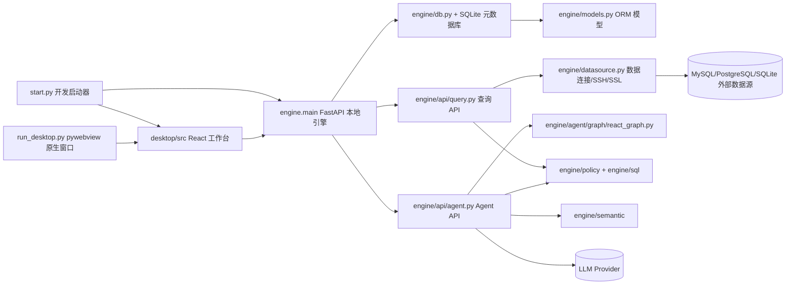
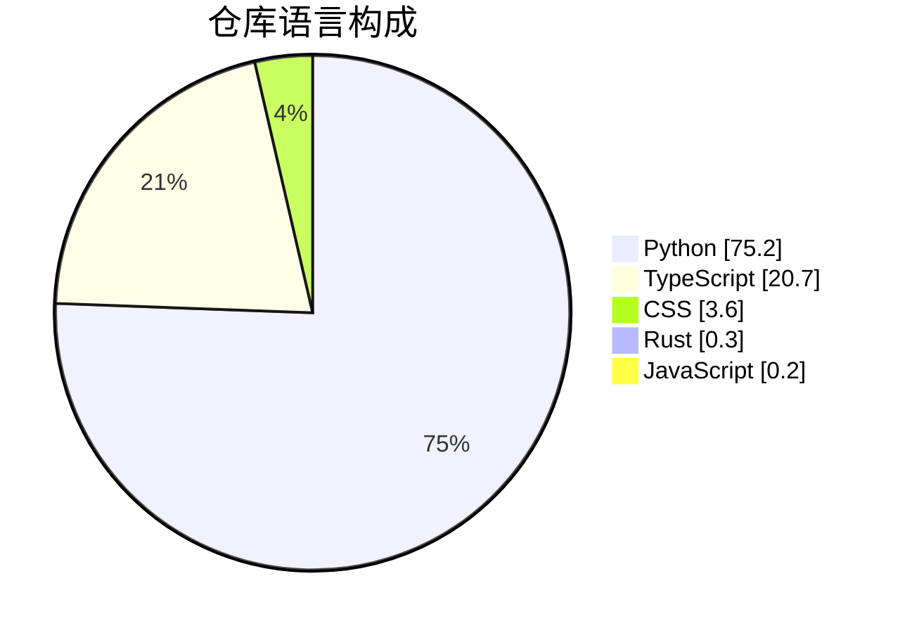
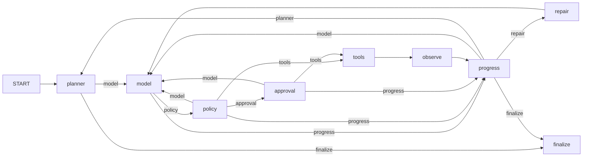

# DataBox 仓库深度研究报告

## 执行摘要

DataBox 是一个“本地优先”的数据库工作台，目标是把传统数据库客户端能力与 AI Agent 协作能力放在同一个桌面产品里。README 将其定义为“Local-First Database Workbench with AI Agent Copilot”，强调数据源管理、Schema 浏览、SQL 编辑、结果网格、查询历史、ER/表结构可视化，以及基于 LangGraph 的 ReAct Agent，用于理解上下文、选工具、生成 SQL、解释结果并产出 artifacts。当前仓库语言以 Python 为主，辅以 TypeScript/CSS 和少量 Rust；根目录显示共有 354 次提交，Actions 工作流累计 338 次运行。

从工程实现看，这不是一个“只有聊天问数”的仓库，而是一个后端较重、状态模型较多、带迁移和持久化的本地数据产品：后端使用 FastAPI、SQLAlchemy、Alembic、LangGraph、LangChain/OpenAI 客户端，并支持 MySQL、PostgreSQL、SQLite、SSH 隧道和 SSL；前端使用 React 19、Vite、Tauri API、Monaco、ECharts、XYFlow、Radix UI 和 Vitest。CI 也覆盖了后端 pytest、mypy、Alembic 迁移、FastAPI smoke test，以及前端 lint、unit test、build。

不过，仓库当前也存在明显的“高速演进期”信号。最值得注意的包括：README 架构路径与当前实际目录存在漂移；桌面端同时出现 React+Tauri、浏览器开发模式、以及 pywebview 原生窗口三条运行路径，产品交付形态并不统一；依赖声明分散在 `pyproject.toml`、`requirements*.txt`、`desktop/package.json`，甚至 `start.py` 还会在运行时直接 `pip install` 一组最小依赖；根目录还可见 `node_modules`、`_server_pid.txt`、`log.txt` 等不应提交的运行产物；Issues 共有 7 个 open、0 closed，但目前公开可见的 7 个 issue 标题完全重复；没有公开 release；README 显示 MIT 徽章，但顶层 `LICENSE` 文件在本次审查时并未成功获取，因此法律文本状态存在不确定性。

## 项目定位与整体架构

README 对项目边界的定义相当明确：它把产品划分为两个域。其一是“Basic Database Software”，覆盖 datasource、schema、query、SQL editor、result grid、history 与 ER/列可视化；其二是“Agent Copilot”，覆盖聊天、上下文理解、SQL 生成/修复/解释/优化、结果解释、工具调用与审批控制。README 同时声明旧的 Text-to-SQL 路径已在 Phase 1 中被移除，未来的 Phase 2 将把重点放在语义理解、环境层和上下文/记忆架构重构上。

从当前代码树来看，系统可以理解为“前端工作台 + 本地 FastAPI 引擎 + 代理编排层 + 数据连接/Schema/策略/语义层 + 本地 SQLite 元数据与运行时持久化”的组合。前端入口是 `desktop/src/main.tsx`；开发态启动器是 `start.py`；原生桌面窗口启动器是 `run_desktop.py`；代理流由 LangGraph `StateGraph` 驱动，节点包括 planner、model、policy、tools、observe、progress、approval、repair、finalize。

下面的图是基于 README、实际目录树以及 `react_graph.py` 汇总出的当前高层架构。值得注意的是，README 仍写着 `engine/databox_agent/`、`engine/executor.py`、`engine/trust_gate.py`，但实际目录更接近 `engine/agent/`、`engine/sql/*` 与 `engine/policy/*`，这说明文档已经落后于当前实现。



下表对关键文件与目录角色做了压缩梳理。

| 文件或目录 | 角色 | 观察 |
|---|---|---|
| `README.md` | 项目定位、API 概览、本地开发、安全原则、阶段状态 | 内容很完整，但路径说明已与现行目录部分漂移。 | |
| `pyproject.toml` | Python 包元数据和基础依赖声明 | 要求 Python `>=3.12`，包含 FastAPI、Alembic、LangGraph、LangChain/OpenAI、SSHTunnel 等。 | |
| `requirements.txt` / `requirements-dev.txt` | 运行/开发依赖锁定 | 运行依赖有较细版本钉住；开发依赖再叠加 mypy、ruff、coverage、black。 | |
| `start.py` | 一键开发启动 | 会安装最小 Python 依赖、检查 `node_modules`、启动 `engine.main --reload` 和 `npm run dev`，然后自动打开浏览器。 | |
| `run_desktop.py` | 原生桌面启动器 | 会安装 `pywebview`，探测后端和前端端口，并创建本地桌面窗口。 | |
| `engine/main.py` | FastAPI 应用入口 | 负责本地 token、应用生命周期与路由装配；CI 以它做 `/api/v1/health` 启动验证。 | |
| `engine/db.py` | DB Session 与迁移初始化 | `init_db()` 会先物理备份，再做兼容清理/Alembic 升级，异常时可回滚恢复。 | |
| `engine/models.py` | 核心数据模型 | 包含 Project、Environment、DataSource、Schema、QueryHistory、Agent*、Semantic* 等多组实体。 | |
| `engine/api/query.py` | SQL API | 暴露 validate/execute/explain/cancel/history 等接口。 | |
| `engine/api/agent.py` | Agent API | 暴露 run、stream、resume、approvals、events、trace、artifacts 等接口。 | |
| `engine/agent/graph/react_graph.py` | Agent 状态图编排 | 显式注册 planner/model/policy/tools/observe/progress/approval/repair/finalize 节点和条件分支。 | |
| `engine/semantic/schema_linker.py` | 语义 Schema Linking | 通过规则和打分把问题映射到表/列/别名。 | |
| `.github/workflows/ci.yml` | CI 管道 | 后端跑 pytest+mypy+迁移+smoke test，前端跑 npm ci/lint/test/build。 | |

下面这段极短摘录说明，Agent 图确实是以显式节点方式拼装，而不是“黑盒”运行时。

```python
graph.add_node("planner", create_plan)
graph.add_node("model", call_model)
graph.add_node("policy", apply_policy)
graph.add_node("tools", execute_allowed_tools)
```

## 代码库剖析

GitHub 语言统计显示，该仓库以 Python 为主导，占 75.2%；TypeScript 占 20.7%；CSS 占 3.6%；另有少量 Rust、JavaScript 和 Mako。这个分布与“Python 后端 + React 前端 + 少量桌面壳/模板文件”的结构相吻合。Python 侧实际承载了连接、迁移、模型、策略、语义与 Agent 编排等绝大多数复杂性；前端更多承担工作台交互、编辑器、图表和结果可视化。



依赖层面，后端和前端都不是“轻脚手架”。后端除了 Web 框架外，还引入数据库迁移、SSH 隧道、PostgreSQL/MySQL 驱动、LangGraph、LangChain/OpenAI 接口和 SQLite checkpoint；前端则包含 Monaco 编辑器、Radix UI、XYFlow、ECharts、Vitest 与 Tauri CLI。更重要的是，仓库里至少同时存在四套依赖/构建入口：`pyproject.toml`、`requirements.txt`、`requirements-dev.txt`、`desktop/package.json`，再加上 `start.py` 的运行时安装逻辑，这会放大依赖漂移和环境不可复现的风险。

| 依赖层 | 代表组件 | 作用 |
|---|---|---|
| Python Web / API | `fastapi`, `uvicorn`, `pydantic`, `python-multipart` | 本地 HTTP API、请求建模与服务运行。 | |
| Python 数据层 | `sqlalchemy`, `alembic`, `pymysql`, `psycopg2-binary`, `sshtunnel`, `cryptography` | ORM、迁移、MySQL/PostgreSQL 连接、SSH 隧道、加密。 | |
| Python Agent / LLM | `langgraph`, `langgraph-checkpoint-sqlite`, `langchain-openai`, `langchain-core` | ReAct 图编排、检查点、LLM 调用。 | |
| Python 质量工具 | `pytest`, `pytest-asyncio`, `mypy`, `ruff`, `black`, `coverage` | 测试、类型、静态检查、格式化与覆盖率。 | |
| 前端运行时 | `react`, `react-dom`, `@monaco-editor/react`, `@xyflow/react`, `echarts`, `echarts-for-react`, `@tauri-apps/api` | UI、编辑器、流程图/ER 图、可视化、桌面桥接。 | |
| 前端构建测试 | `vite`, `typescript`, `vitest`, `eslint`, `@vitejs/plugin-react`, `tailwindcss` | 编译、测试、Lint、样式。 | |

入口点也非常清晰。`desktop/src/main.tsx` 用 `createRoot(...).render(<App />)` 启动 React 应用；`App.tsx` 的默认 tab 是“问数工作台”，并且导入了 `DataSourcesPage`、`AgentEvalPage`、`LlmConfigPanel` 等模块，说明前端已经扩展到不止一个单页视图；`start.py` 负责 dev 模式；`run_desktop.py` 负责 pywebview 本地窗口模式。与此同时，README 又把桌面端称为 “React + Tauri workbench”，而 `desktop/package.json` 也保留了 `tauri` 脚本与 `@tauri-apps/api/@tauri-apps/cli` 依赖，这表明桌面封装路线目前处于混合或迁移状态，而不是单一路径。

数据模型是这个仓库最“重”的一层。`engine/models.py` 不只是保存 datasource 和 query history，而是建立了一个完整的本地元数据与代理运行时数据库：`Project` / `DatabaseEnvironment` / `DataSource` 定义工作区、环境和连接；`SchemaTable` / `SchemaColumn` 保存已同步的表列元数据；`QueryHistory` 与 `GoldenSQL` 记录查询历史与基准 SQL；`AgentSession` / `AgentRun` / `AgentApproval` / `AgentCheckpoint` / `AgentArtifactRecord` / `AgentRuntimeEventRecord` / `AgentTraceEventRecord` 则把 Agent 运行全过程落到数据库；`TableDesignDraft` 与 `SemanticAlias` / `SemanticMetric` / `SemanticDimension` / `WorkspaceTableScope` 又为表设计和语义层打了基础。

| 模型族 | 代表实体 | 作用 |
|---|---|---|
| 工作区与环境 | `Project`, `DatabaseEnvironment` | 组织工作区、数据库运行环境和健康状态。 | |
| 数据源与连接 | `DataSource` | 保存 DB 类型、主机、端口、库名、加密密码、SSH、SSL 配置。 | |
| Schema 元数据 | `SchemaTable`, `SchemaColumn` | 保存表/列结构、注释、主外键、估算行数。 | |
| 查询与评测 | `QueryHistory`, `GoldenSQL` | 保存执行历史和问句到标准 SQL 的映射。 | |
| Agent 会话 | `AgentSession`, `AgentRun` | 把一次连续会话与单次运行分离建模。 | |
| 人工审批与恢复 | `AgentApproval`, `AgentCheckpoint` | 支持审批、暂停/恢复、状态快照与恢复点。 | |
| 可观测性与产物 | `AgentArtifactRecord`, `AgentRuntimeEventRecord`, `AgentTraceEventRecord` | 保存产物、运行事件、trace。 | |
| 语义层与设计 | `TableDesignDraft`, `SemanticAlias`, `SemanticMetric`, `SemanticDimension`, `WorkspaceTableScope` | 面向语义理解、草稿设计与工作区表范围控制。 | |

API 边界同样相当完整。README 给出了总览，`engine/api/query.py` 落实了 `/query/validate`、`/query/execute`、`/query/explain`、`/query/cancel`、`/query/history`，`engine/api/agent.py` 落实了 `/agent/run`、`/agent/run/stream`、`/agent/runs/{run_id}/resume`、`/approvals`、`/trace`、`/artifacts` 等路径，并用 SSE 输出流式事件。换句话说，后端已经是一套“可以独立消费”的本地 API 层，而不是只能服务当前前端页面的临时脚本。

算法上，最值得重点看三处。第一，Agent 图是显式可控的条件路由图：`planner → model → policy → tools → observe → progress`，其中 `progress` 可再路由回 `model`、`planner`、`repair` 或 `finalize`。第二，`schema_linker.py` 使用规则打分做轻量语义层：表/列名精确匹配、token 匹配、注释匹配、alias 匹配分别加不同分值，例如表名 exact match 加 15 分、table token match 加 8 分、alias match 加 12 分，列级也有独立加权。第三，`db.init_db()` 的迁移策略不是简单地 `upgrade head`，而是在升级前先做物理备份，必要时兼容旧迁移记录，再通过 Alembic 升级并在失败时恢复，这对本地单机产品尤其重要。

下面这张图把 Agent 工作流再单独画出来，便于理解运行时的控制点与恢复点。



## 活跃度与工程健康

就“活跃度”本身而言，这个仓库是明显活跃的。根页面显示 354 次提交，而 Actions 工作流页面显示 `ci.yml` 已经积累了 338 次运行；最近两天的提交非常密集，主题集中在 Agent runtime、环境与语义工具、LLM 配置 UI、Agent 工作台与 artifact 渲染、以及对 Docker/旧页面/测试的清理。这说明项目不是停滞仓库，而是高频重构中的进行时项目。

不过，社区信号几乎为零：根页面显示 0 stars、0 watchers、0 forks；仓库也没有公开 description、website 或 topics。这并不意味着项目没有价值，但表示它目前更像个人/小团队内生演进项目，而不是已经形成外部用户生态的开源产品。

| 日期 | 提交 | 主题 | 备注 |
|---|---|---|---|
| 2026-06-11 | `00098e8` | 为 conversations 增加持久化并调整 LLM provider client 配置 | 最近可见提交之一。 | |
| 2026-06-11 | `f97ac53` | 实现 agent query workspace、artifact rendering 和 response management | 前后端联动明显。 | |
| 2026-06-11 | `eccc136` | 引入 environment 和 semantic agent tools，并支持 hot-reload engine | 说明语义层与环境层正在成形。 | |
| 2026-06-11 | `abc17ac` | 初始化项目结构并实现 LLM configuration management UI | 与桌面端 LLM 配置页相关。 | |
| 2026-06-11 | `80ab5d2` | 删除 demo/offline/Docker 基础设施，统一页面并修测试 | 说明 Docker 路线至少近期被收缩或移除。 | |
| 2026-06-10 | 一组连续提交 | 增删 LLM settings workspace / router / wrappers | 代表正在快速试错、重构 UI 与 API 边界。 | |

贡献者方面，公开可解析的提交历史至少显示近期有 `thtux` 和 `trrueee` 两位作者在提交；但 GitHub Contributors 图在本次抓取的静态 HTML 中没有暴露总人数与提交分布，只显示“Loading / Crunching the latest data”，因此精确 contributor 数量在本报告中只能标注为未明确。与此同时，Pull Requests 页面显示 0 open、0 closed，说明当前开发流很可能以直接推送到 `main` 为主，而不是经 PR 审查驱动。

Issue 侧的信号更值得注意。页面显示共有 7 个 open issue，closed 结果为 0；而这 7 个可见 issue 的标题、标签和打开日期都基本一致，均为 “Agent Runtime 重构：从固定流水线升级为受控、可恢复、证据驱动的数据分析 Agent”，标签也都带有 `agent`、`architecture`、`refactor`。这更像是重复创建、同步脚本异常或流程使用不当，而不是健康的 backlog 管理。

| Issue | 标题 | 标签 | 状态 | 打开时间 | 备注 |
|---|---|---|---|---|---|
| #8 | Agent Runtime 重构：从固定流水线升级为受控、可恢复、证据驱动的数据分析 Agent | `agent`, `architecture`, `refactor` | Open | 2026-06-07 | 与其他 issue 同标题，疑似重复。 | |
| #7 | 同上 | `agent`, `architecture`, `refactor` | Open | 2026-06-07 | 疑似重复。 | |
| #6 | 同上 | `agent`, `architecture`, `refactor` | Open | 2026-06-07 | 疑似重复。 | |
| #5 | 同上 | `agent`, `architecture`, `refactor` | Open | 2026-06-07 | 疑似重复。 | |
| #4 | 同上 | `agent`, `architecture`, `refactor` | Open | 2026-06-07 | 疑似重复。 | |
| #3 | 同上 | `agent`, `architecture`, `refactor` | Open | 2026-06-07 | 疑似重复。 | |
| #2 | 同上 | `agent`, `architecture`, `refactor` | Open | 2026-06-07 | 疑似重复。 | |

版本治理目前偏弱。根页面和 tags/release 页都显示“未发布 release”；是否存在“仅有 git tag、但未发布 release”的情况，在可抓取页面中没有暴露具体 tag 名称，因此只能说“公开发布的 release/tag 目前不可见或不存在”。CI 方面，`.github/workflows/ci.yml` 的定义是完整的，而且 Actions 页显示大量运行记录；但本次可访问的静态页面并未稳定暴露最近一次运行的 success/failure 文本状态，因此“CI 是否当前绿色”只能标为未明确，而不能武断写成通过或失败。许可证方面，README 徽章声明 MIT，但顶层 `LICENSE` 文件在本次访问中返回 404，因此法律文本是否完整提交仍需仓库维护者核实。

## 搭建、部署与贡献实践

本仓库最明确、最可靠的启动方式仍是 README 的本地开发流程：先建 Python 虚拟环境并安装 `requirements.txt`，再运行 `python -m engine.main`；前端在 `desktop/` 中执行 `npm install && npm run dev`；测试层面则分别是 `python -m pytest`、`python -m pytest -m "not e2e"` 和 `cd desktop && npm test`。这一套说明与 CI 中的 Python 3.12、Node 22 也基本一致。

如果希望“脚本统一拉起”，仓库还提供了 `start.py`。它会先检测并安装一组最小 Python 依赖，再判断 `desktop/node_modules` 是否存在，不存在则执行 `npm install`，随后用 `python -m engine.main --reload` 拉起后端、用 `npm run dev` 拉起前端，并在确认 18625 端口就绪后自动打开 `http://localhost:5173`。这对新开发者很方便，但从可复现性角度看，它也绕开了完整锁文件与虚拟环境治理。

如果希望进入“桌面窗口”而不是浏览器，仓库另有 `run_desktop.py`。它会自动安装 `pywebview`，检查后端 18625 端口与前端 dev server，如果未启动则尝试自动拉起，然后通过 `webview.create_window()` 打开本地原生窗口。这与 README/`package.json` 提到的 Tauri 路线并存，说明目前桌面部署方式并未收敛为单一标准。官方意图的最终发布形态，在仓库中仍属未明确。

下面这段简短摘录，准确反映了当前 dev 启动器的核心行为。

```python
[sys.executable, "-m", "engine.main", "--reload"]
"npm run dev"
```

本仓库暂时看不到 Docker 作为主流部署路径。README 当前主推 virtualenv + npm 的本地开发；而 2026-06-11 的 `80ab5d2` 提交标题还明确写着“Remove demo/offline/Docker infrastructure”。结合根目录文件列表中也未见 Dockerfile，可以判断：Docker 至少不是这个时间点推荐的标准启动方式。若用户想知道“生产环境怎么部署”，仓库并没有给出明确答案，因此应标注为 unspecified。

贡献实践方面，仓库已经提供了比较好的“可执行”入口，但“贡献流程文档”仍不够完整。优点是：后端测试目录可见大量 Agent、API、架构、备份、加密、数据源 SSL/SSL e2e 相关测试文件；CI 也执行 pytest、mypy、前端 lint/test/build。问题在于：`requirements-dev.txt` 包含 `ruff`、`black`、`coverage`，但 CI 并未运行 black/ruff/coverage gate；另外可访问的 `.github/workflows` 目录只看到 `ci.yml`，没有在本次审查中明确看到 CONTRIBUTING、issue template 或 PR template 的公共文档入口。

常见坑点主要有五个。第一，开发者最好显式使用 `.venv`，不要完全依赖 `start.py` 的运行时安装。第二，默认端口是后端 `18625`、前端 `5173`，本地冲突会直接导致启动失败。第三，`run_desktop.py` 在 Windows 下使用 `taskkill /F /T` 回收前端子进程，跨平台行为需要单独验证。第四，前端 `package.json` 要求 Node `>=20.19.0`，而 CI 用的是 Node 22，本地过旧版本会踩坑。第五，当前仓库根目录已包含 `node_modules`、`log.txt`、`_server_pid.txt` 等运行痕迹，这本身就是环境卫生不稳的信号，新贡献者应优先清理而不是沿用。

## 风险、可扩展性与维护性评估

从安全视角看，DataBox 的方向是对的。README 明确要求所有 SQL 在执行前都要经过 policy enforcement；Agent 的自动 SQL 执行必须被 policy-gated；不得绕过 `sql.validate` 或 `safe_sql`。实现上，`query.py` 在执行前暴露了 `/query/validate`，并调用 `guardrail_check()`；模型层也为数据源密码、SSH 密码和私钥口令预留了 `ciphertext + nonce + key_version` 字段，而 `datasource.py` 又支持 SSL 参数构造与 SSH 隧道，这说明作者并非忽略安全，而是在做“本地可信代理”的最小安全闭环。

真正的问题不在“有没有安全意识”，而在“工程闭环还没完全闭合”。首先，README 说本地运行状态、API keys、SQLite 数据库、生成报告等不应提交，但根目录仍可见 `node_modules`、`_server_pid.txt`、`log.txt`；这属于仓库卫生与秘密管理纪律没有完全落到实践。其次，README 只给出 MIT 徽章，顶层 `LICENSE` 却未能获取；对外开源时，这会形成法律与分发层面的不确定性。再次，LLM 工厂虽然提供了 `OPENAI_API_KEY`、`QWEN_API_KEY`、`DATABOX_LLM_API_KEY` 等环境变量入口，但具体密钥轮换、持久化和 UI 配置导出行为，在公开文档里没有说清。

在可扩展性方面，当前实现更适合“本地单机工作台”，而不是“多用户高并发平台”。一方面，Schema linking 是规则打分模型：从源码可以看到，它会对表名、列名、注释、alias 逐项做 token/exact 匹配并累积分数；这很好理解，也足够可控，但我据此推断，在非常大的 schema 上，它会呈现按表/列线性放大的扫描开销。另一方面，Agent 运行会把 checkpoint、artifacts、runtime events、trace events 以 JSON 文本形式持久化到数据库；如果没有清理/归档策略，本地 SQLite 会持续膨胀。再者，LangGraph checkpoint 在依赖缺失时会回退到 in-memory saver，这虽能提高弹性，但也可能让恢复行为在不同环境下不一致。以上关于性能与容量的判断，属于基于源码实现方式的工程推断，而不是仓库明示的基准数字。

在可维护性上，测试面是加分项，流程闭环是减分项。加分项在于：`engine/tests` 可见覆盖 Agent 审批、artifact、checkpoint resume、eval、runtime、tool registry、workspace context、API、backup、crypto、datasource SSL/e2e 等多类测试，前端也有 Vitest；CI 对后端和前端都做了基础回归。减分项在于：CI 没有覆盖 `run_desktop.py` / pywebview / Tauri 打包链路；没有运行 black/ruff/coverage；Issues 管理明显紊乱；README 与当前目录路径漂移。这些都不会阻止仓库继续开发，但会显著提高后续协作成本。

## 改进建议与优先事项

综合以上分析，我认为 DataBox 的优先目标不应只是“继续加新功能”，而是先把“产品形态、仓库卫生、依赖治理、发布治理”收紧。当前仓库已经具备一个很强的技术雏形：本地优先、显式策略门控、可恢复 Agent、语义层、工作台 UI、自动迁移和测试框架都在。但如果不先把基础工程面收口，后续复杂度会比功能增长更快。

| 优先级 | 建议 | 原因 |
|---|---|---|
| 短期 | 统一 README 与当前目录/模块路径，修正 `engine/databox_agent`、`engine/executor.py`、`engine/trust_gate.py` 等陈旧说明 | 当前文档与代码树已有明显漂移，会直接误导新贡献者和使用者。 | |
| 短期 | 清理已提交运行产物与依赖目录，补强 `.gitignore` | 根目录出现 `node_modules`、`log.txt`、`_server_pid.txt`，与 README 的安全原则相冲突。 | |
| 短期 | 补齐真正的 `LICENSE` 文件，并建立 release/tag 流程 | 当前只有 MIT 徽章、没有可验证的 LICENSE 文本，也没有 release。 | |
| 短期 | 合并依赖与启动入口，避免 `start.py` 运行时 `pip install` 与锁文件漂移 | 依赖定义分散，自动安装会削弱环境可复现性。 | |
| 短期 | 整理 issue backlog，去重 7 个重复 open issue，并公开 roadmap | 当前 issue 列表明显异常，无法承担有效项目管理作用。 | |
| 中期 | 明确桌面发布路线：Tauri、pywebview 或纯浏览器开发模式三选一为主，另外两条降级为辅助 | 当前存在三条并行路径，文档和打包链路都会被拖乱。 | |
| 中期 | CI 加入 backend lint/format/coverage gate，并补充桌面打包 smoke test | 现有 CI 已有好基础，但还缺 black/ruff/coverage 和桌面链路验证。 | |
| 中期 | 增加 CONTRIBUTING、Issue/PR 模板、变更日志 | 当前贡献入口更像“读代码自学”，而不是标准化协作。 | |
| 长期 | 为 schema linking / context pack 增加索引、缓存或分层筛选机制 | 规则打分实现简单可靠，但规模放大后可能成为性能瓶颈。 | |
| 长期 | 为 checkpoint、artifact、runtime events 建立保留策略与清理策略 | 当前持久化模型丰富，但容量治理尚未显式出现。 | |
| 长期 | 若计划面向更广用户，补充生产部署文档和密钥管理说明 | 目前定位仍明显偏本地单机；生产部署环境与最终分发方式均未明确。 | |

如果按“短/中/长期”落地，我会建议这样排序：短期先做仓库卫生、文档对齐、许可证与 issue 去重；中期收敛桌面形态并强化 CI；长期再优化大 schema 性能、运行时数据 retention 和更正式的发布/部署体系。这样做的收益最大，因为它不需要改变 DataBox 的核心产品方向，却能显著提高这个仓库的可读性、可协作性和可持续演进能力。