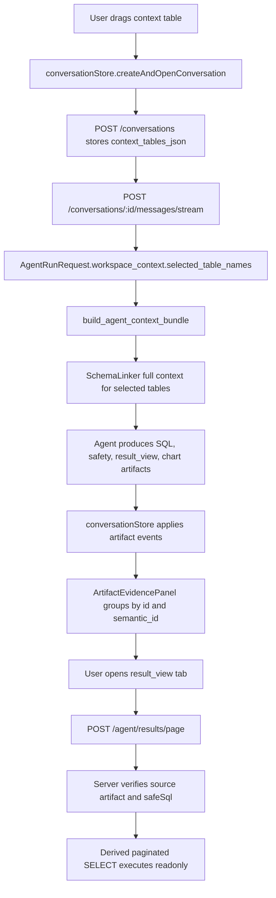

# Trusted Query Chain Design

**Goal:** Rebuild the first DBFox trusted query path as one coherent business flow: selected context tables enter the Agent run, Agent artifacts form a stable evidence group, safety is visible, and result pagination remains bound to the original safe SQL artifact.

**Architecture:** Keep the existing Conversation, Agent runtime, artifact persistence, and result tab architecture. This design connects the missing contracts between them instead of introducing a parallel query flow. The main contract is: a conversation's selected context tables influence schema context, a run's SQL/safety/result artifacts share dependable identifiers, and later result pagination can only derive from the persisted safe SQL artifact that the Agent produced.

**Tech Stack:** FastAPI, SQLAlchemy, Pydantic, LangGraph-backed Agent runtime, sqlglot, React, TypeScript, Zustand, Vitest/Testing Library, pytest.

## Global Constraints

- Do not rewrite the Agent graph or replace the existing `conversationStore + ConversationWorkspace` path.
- Preserve compatibility with existing artifact records that depend on physical `id` instead of `semantic_id`.
- Do not make `safety` a blocking modal in this slice; approval UI remains a later feature.
- Do not trust client-provided `safeSql` for result pagination unless it matches a persisted Agent artifact.
- Use TDD for implementation: every behavior change starts with a failing test.

---

## Scope

This slice covers the first complete trusted query chain:

1. User selects or drags context tables before asking.
2. Conversation creation persists those table names.
3. Conversation streaming builds an `AgentRunRequest` with `workspace_context.selected_table_names`.
4. Existing Agent context building uses those table names to build selected table schema and schema linking context.
5. SQL, safety, result view, and chart artifacts are mapped and grouped consistently in the frontend.
6. The evidence panel shows a lightweight trust card for safety artifacts.
7. Opening a SQL-backed result tab pages through `/agent/results/page`.
8. The pagination endpoint verifies the request against the persisted source artifact before executing derived SQL.

Out of scope:

- Stage Timeline redesign.
- Full ApprovalCard and approval resume UX.
- Agent state namespace refactor.
- `observe_tools()` decomposition.
- SQL lifecycle tool unification.
- Dark mode/token cleanup.

## Business Flow



## Backend Design

### Conversation to Agent Context

`engine/api/conversations.py` will add a small helper that reads `AgentSession.context_tables_json` safely:

- Accept only JSON arrays.
- Keep only non-empty string table names.
- Deduplicate while preserving order.
- Treat malformed JSON as no context tables instead of failing the stream.

`stream_conversation_message()` will construct:

```python
AgentWorkspaceContext(
    datasource_id=session.datasource_id,
    selected_table_names=context_tables,
)
```

and pass it to `AgentRunRequest.workspace_context`.

The existing `engine/agent_core/workspace_context.py` already resolves `selected_table_names` in `_selected_tables()` and feeds selected table ids into `SchemaLinker.full_context()`. The implementation should not duplicate schema linking logic in the API layer.

### Result Pagination Safety

`engine/api/agent.py` will stop treating request `safeSql` as authoritative. The endpoint will:

1. Load `AgentArtifactRecord` using `sourceSqlArtifactId`.
2. Support lookup by physical `id` first, then by `semantic_id`.
3. Require artifact type to be `result_view`, `table`, or `sql`.
4. Extract the persisted safe SQL from artifact payload keys in this order:
   - `safeSql`
   - `safe_sql`
   - `sourceSql`
   - `sql`
5. Compare normalized persisted SQL with normalized request `safeSql`.
6. Reject the request with HTTP 400 when no persisted safe SQL exists or the SQL does not match.
7. Build derived SQL only from the persisted safe SQL.
8. Validate derived SQL as a single SELECT statement before execution.

This preserves the existing `build_derived_sql()` and `validate_derived_sql()` shape, but execution no longer depends only on a client string.

Sorting remains limited to column names received from the UI and quoted through sqlglot identifiers. Search and arbitrary filters remain accepted by the request model but are not applied in this slice.

## Frontend Design

### Artifact Mapping

`desktop/src/features/workspace/agentBridge.ts` will map:

- `result_view` to `ResultViewArtifact`.
- `safety` to a `markdown` artifact or a dedicated frontend-safe representation that can render in conversation evidence.

The mapping should handle both camelCase and snake_case payloads because backend events and persisted records may differ:

- `previewRows` / `preview_rows`
- `rowCount` / `row_count`
- `safeSql` / `safe_sql`
- `sourceSqlSemanticId` / `source_sql_semantic_id`
- `storageMode` / `storage_mode`

### Artifact Dependency Contract

`desktop/src/features/conversation/workspace/ArtifactEvidencePanel.tsx` will build two lookup maps:

- `byId`
- `bySemanticId`

Grouping rules:

1. SQL artifacts start evidence groups.
2. A `safety` artifact belongs under a SQL group when its `depends_on` contains the SQL physical `id` or `semantic_id`.
3. A `result_view` or `table` artifact belongs under a SQL group when its `depends_on` contains the SQL physical `id` or `semantic_id`.
4. A `chart` belongs under the SQL group when it depends on the SQL or on any grouped result artifact by physical `id` or `semantic_id`.
5. Artifacts that cannot be grouped remain visible as orphan artifacts instead of being dropped.

This gives `semantic_id` priority without breaking existing records.

### Safety Trust Card

The evidence panel will render `safety` artifacts as a compact trust card under the related SQL block. The first version shows:

- passed / failed / warning status.
- can execute.
- requires confirmation.
- guardrail result.
- schema warning count.
- short notices and warnings when present.

The card is informational and default-collapsed when the SQL group is large. It does not approve or resume Agent runs.

### Result Tab Pagination

`TableArtifactView` already sends `sourceSqlArtifactId`, `safeSql`, page, page size, and sort. The backend change makes `sourceSqlArtifactId` meaningful. Frontend behavior remains the same except that `result_view` mapping must populate:

- `sourceSqlSemanticId`
- `safeSql`
- `datasourceId`
- `storageMode`

When the backend rejects pagination because the SQL no longer matches the persisted artifact, the existing fetch error UI will display the backend message.

## Error Handling

- Malformed `context_tables_json`: stream continues with empty selected table context.
- Context table name not found in schema: Agent receives the table name in `workspace_context`, but selected table schema will be empty; schema linking falls back to normal datasource linking.
- Artifact depends on unknown id: artifact is shown as orphan.
- `result_view` payload lacks `safeSql`: it can render preview rows but SQL-backed pagination is disabled or fails with a clear backend error.
- Pagination source artifact not found: HTTP 404 or 400 with `SOURCE_ARTIFACT_NOT_FOUND`.
- Pagination SQL mismatch: HTTP 400 with `SOURCE_SQL_MISMATCH`.
- Derived SQL validation failure: HTTP 400 with existing `DERIVED_SQL_VALIDATION_FAILED`.

## Testing Strategy

Backend tests:

- Conversation stream builds `AgentRunRequest.workspace_context.selected_table_names` from persisted `context_tables_json`.
- Malformed `context_tables_json` does not fail the stream.
- Result pagination rejects a request when `safeSql` differs from the persisted artifact payload.
- Result pagination accepts a request when `safeSql` matches the persisted artifact payload and derived SQL validates.
- Result pagination rejects non-SELECT or multi-statement SQL even if the client submits it as `safeSql`.

Frontend tests:

- `agentBridge` maps `result_view` to a usable `ResultViewArtifact`.
- `agentBridge` maps `safety` into a renderable evidence artifact.
- `ArtifactEvidencePanel` groups SQL, safety, result view, and chart when dependencies reference `semantic_id`.
- `ArtifactEvidencePanel` still groups existing artifacts when dependencies reference physical `id`.
- Orphan artifacts remain visible.

Recommended verification commands after implementation:

```powershell
pytest engine/tests/test_agent_api.py engine/tests/test_conversations.py
cd desktop; npm run test -- --run
cd desktop; npm run lint
```

## Acceptance Criteria

- Dragging `orders` into Smart Query context and asking a question results in an Agent request with `workspace_context.selected_table_names` containing `orders`.
- A successful SQL run shows SQL, safety trust card, result view, and chart in one evidence group when their dependencies refer to semantic ids.
- Existing id-based artifact dependencies still group correctly.
- A `result_view` artifact can open as a result tab and request SQL-backed pages.
- Tampering with `safeSql` in a pagination request is rejected by the backend.
- The implementation does not add a new Agent runtime path or a new frontend store.

## Self-Review

- Placeholder scan: no incomplete placeholder markers are present.
- Scope check: this is one coherent chain and excludes Timeline, ApprovalCard, state refactor, observe refactor, SQL lifecycle redesign, and visual token cleanup.
- Contract consistency: `sourceSqlArtifactId`, `safeSql`, `semantic_id`, `depends_on`, and `workspace_context.selected_table_names` are used consistently across backend and frontend sections.
- Compatibility check: id-based grouping and existing result tab behavior remain supported.
